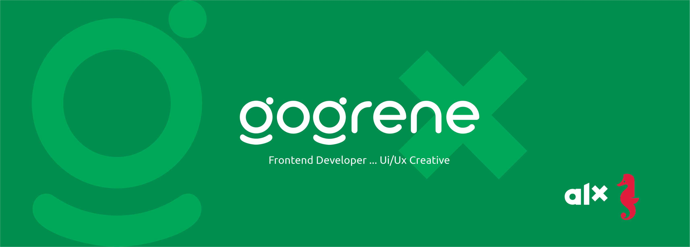

### Hi dear! I'm Emma. You can call me gogrene. 👋 

### I am a Frontend Developer and Ui/Ux designer.

- 🌱 I’m currently learning Software Engineering at [alx/Holberton School](https://www.alxafrica.com/software-engineering-2022). 🤣
- 👯 I’m looking to collaborate with other Web Devops
- 🥅 2022 Goals: 
    - Complete my alx certification course.
    - Perfect my Web stacks skills.
    - Master MERN.
- ⚡ Fun fact: I love graphics design, I am good with creating engaging Ui designs, and love to learn new things. 
- 😻 I am working on my first web app.

### Connect with me:

&nbsp;&nbsp;

&nbsp;&nbsp;

&nbsp;&nbsp;

### Languages and Tools:

 
 

:zap: GitHub Stats

